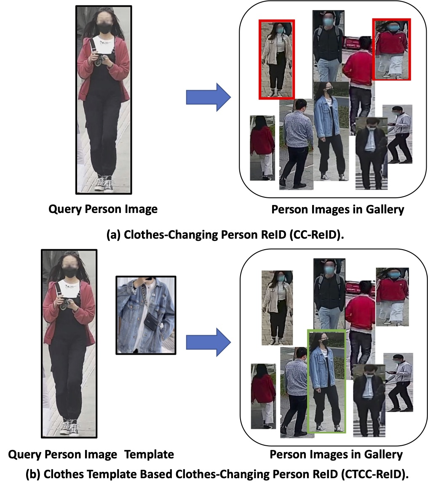

# COCAS-plus
## Abstract
Recent years person re-identification (ReID) has been developed rapidly due to its broad practical applications. Most existing benchmarks assume that the same person wears the same clothes across captured images, while, in real-world scenarios, person may change his/her clothes frequently. Thus the Clothes-Changing person ReID (CC-ReID) problem is introduced and several related benchmarks are established. CC-ReID is a very difficult task as the main visual characteristics of a human body, clothes, are different between query and gallery, and clothes-irrelevant features are relatively weak. To promote the research and applications of person ReID in clothes-changing scenarios, in this paper, we introduce a new task called Clothes Template based Clothes-Changing person ReID (CTCC-ReID), where the query image is enhanced by a clothes template which shares similar visual patterns with the clothes of the target person image in the gallery. So, ReID methods are encouraged to jointly consider the original query image and the given clothes template for retrieval in the proposed CTCC-ReID setting. To facilitate research works on CTCC-ReID, we construct a novel large-scale ReID dataset named ClOthes ChAnging person Set Plus (COCAS+), which contains both realistic and synthetic clothes-changing person images with manually collected clothes templates. Furthermore, we propose a novel Dual-Attention Biometric-Clothes Transfusion Network (DualBCT-Net) for CTCC-ReID, which can effectively learn to extract biometric features from the original query person image and clothes features from the given clothes template and then fuse them through a Dual-Attention Fusion Module. Extensive experimental results show that the proposed CTCC-ReID setting and COCAS+ dataset can help greatly push the performance of clothes-changing ReID toward practical applications, and synthetic data is impressively effective for CTCC-ReID. What's more, the proposed DualBCT-Net shows significant improvements over state-of-the-art methods on the CTCC-ReID task.

## COCAS+ Dataset 
COCAS+ is a large-scale clothes-changing person dataset with clothes templates for the Clothes Template based Clothes-Changing person ReID (CTCC-ReID) task. It contains three distinct subsets: COCAS-Real1, COCAS-Real2 and COCAS-Synthetic. COCAS-Real1 is collected from realistic scenes, with 62,382 images of 5,266 identities. COCAS-Real2 is also realistic but collected from different places in a different season from COCAS-Real1, thus enabling cross-domain generalization evaluation in COCAS+. COCAS-Synthetic contains 1,038 synthetic identities generated using GAT5 engine, based on which synthetic-to-real generalization can be studied. Besides person images, we provide one clothes template image for each outfit that appears in the gallery set.

### Statistical Information of COCAS+
| Dataset    |  Source | ID Num | Image Num | Scene | Camera Num | Clothes Num | 
|------------|-------|------|------|-------|-------|------|
|COCAS-Real1       | Real | 5,266 | 62,382 | Indoor+Ourdoor | 30 | At Most 3 |
|COCAS-Real2       | Real | 101 | 21,319 | Ourdoor | 11  | At Most 3 |
|COCAS-Synthetic       | Synthetic | 1,038 | 92,526 | / | 144  | At Most 4 |

### Data Download
The full datasets can be downloaded via: _comming_ _soon_

## DualBCT-Net
Given the proposed CTCC-ReID task and a new dataset COCAS+, in this section, we further introduce the Dual-Attention Biometric-Clothes Transfusion Network (DualBCT-Net) to address the CTCC-ReID problem. The overall frame-work of DualBCT-Net is shown in Fig. 6. Built upon a ViT architecture, DualBCT-Net contains three main compo-nents: Biometric Branch, Clothes Branch and Dual-Attention Fusion Module, where the Biometric Branch learns to extract biometric feature, such as body shape, contour sketch, hairstyle, from the query person image, while the Clothes Branch learns to extract discriminative clothes feature from the given clothes template, and the Dual-Attention Fusion Module is proposed to effectively fuse information from the two branches to obtain a unified representation that better matches the target image in gallery. The whole DualBCT-Net is trained in an end-to-end manner.

